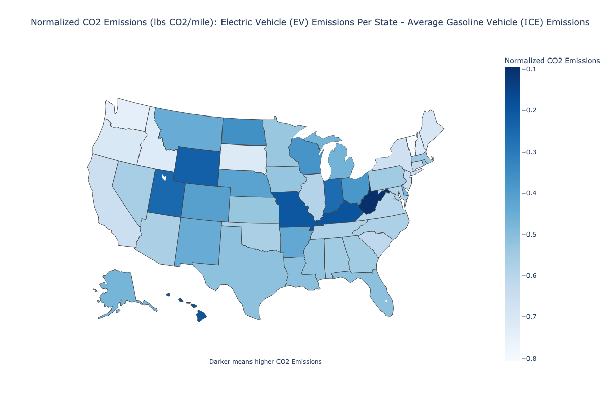

# A Comparison of the CO2 Emissions From Automobiles Powered by Gasoline vs Electricity

## Abstract

Electric Vehicles are typically seen as an environmentally friendly alternative to traditional automobiles which emit Carbon Dioxide (CO2) in the process of burning gasoline.
Many Electric Vehicle manufacturers advertise their cars as "emission-free" because they emit no CO2 in the process of running, however, Electric Vehicles rely on their local power grid to charge their batteries, so an EV actually emits as much CO2 as their local energy generation sources. 

In order to verify the claim that Electric Vehicles are an environmental friendly alternative to traditional automobiles, the emissions from an Internal Combustion Engine (ICE) are compared with the emissions from the US power grid as a whole, as well as each individual state's power grid.

This investigation validates the claim that Electric Vehicles are an environmentally friendly alternative to traditional automobiles, discovering that **the average traditional autmoboile in the US emits 2.742 times more Carbon Dioxide than an Electric Vehicle**. 

As well, **the average Electric Vehicle emits less Carbon Dioxide than the average traditional automobile in all 50 states**, even states with heavy dependencies on fossil fuels.

Consequently, **Electric Vehicles in the United States offer substantial reductions to CO2 Emissions compared with traditional automobiles**, especially in states with a low dependence on fossil fuels.

## Source Code Investigation
Create and activate a virtual environment, then execute `requirements.sh`

* For the main comparisons of emissions between ICE vs EV, see Main.py
* To see the calculations for average CO2 emissions from an ICE, see CO2EmissionsFromICE.py
* To see the calculations for average CO2 emissions from the United States power grid, see TotalCO2EmissionsFromEV.py
* To see the calculations for average CO2 emissions from each state's power grid, see StateCO2EmissionsFromEV.py and 
* To see the results data and figures for state CO2 emissions, see StateResultsData/

# Methodology

In this investigation, publicly available data from the EIA is used to calculate and compare the amount of Carbon Dioxide (CO2) emitted from an Internal Combustion Engine (ICE) vs the power grid which supplies an Electric Vehicle (EV). 

Power sources will be compared using units of lbs CO2/mile driven, measuring the mass of Carbon Dioxide emitted while travelling one mile. For the purpose of this investigation, the emissions per mile are derived using averages and do not factor in speed or type of driving.

Although unrealistic, for the purposes of this investigation a lossless transfer of energy is assumed from the local power grid to Electric Vehicles, as well as a lossless transfer of energy for Internal Combustion Engines.

As well, it is assumed that 1 kWh of energy is utilized equally for Electric and Internal Combustion vehicles.

Gasoline used in this investigation is assumed to be a blend of approximately [10% ethanol content by volume](https://www.eia.gov/energyexplained/units-and-calculators/), and ethanol fuel is assumed to [generate equivalent emissions to finished motor gasoline](https://www.epa.gov/greenvehicles/greenhouse-gas-emissions-typical-passenger-vehicle#:~:text=typical%20passenger%20vehicle%3F-,A%20typical%20passenger%20vehicle%20emits%20about%204.6%20metric%20tons%20of,8%2C887%20grams%20of%20CO2). 

Battery mining/transportation process and gasoline treatment/transportation are out of the scope of this investigation, and therefore will be ignored.

This investigation does not account for EVs charged by personal solar panels, which would decrease CO2 emissions for a singular vehicle. 

Calculations for both types of vehicles can vary based on a multitude of factors, including make, model, year, size, and type of vehicle. For the purpose of this investigation both types of vehicles will be treated as singular entities using averages, however if the data were to be gathered then further work could be done to separate the calculations into different vehicle classes.

# Internal Combustion Engine (ICE)

The average Carbon Dioxide emissions from an ICE per mile driven can be calculated through a series of unit conversions. 

**Goal = ICE's CO2 emissions/Distance Travelled**

Starting with the three core pieces of input data, let
* A = CO2 emissions (kg)/gallon gasoline
* B = Energy generation (btu)/gallon gasoline
* C = Fuel Efficiency (mi)/gallon gasoline

and for unit conversions let
* x = lbs/kg
* y = btu/kWh

If
* Alpha = CO2 Emissions per Energy Generated

and
* Beta = Miles Travelled per Energy Generated

Then
* **Goal = CO2 Emissions per Mile Travelled**

## Sources:

* [CO2 Emissions](https://www.epa.gov/greenvehicles/greenhouse-gas-emissions-typical-passenger-vehicle#:~:text=typical%20passenger%20vehicle%3F-,A%20typical%20passenger%20vehicle%20emits%20about%204.6%20metric%20tons%20of,8%2C887%20grams%20of%20CO2)
* [Energy Generation](https://www.eia.gov/energyexplained/units-and-calculators/)
* Conversions: [btu/kWh](https://www.eia.gov/energyexplained/units-and-calculators/energy-conversion-calculators.php) and [lbs/kg](https://www.rapidtables.com/convert/weight/kg-to-pound.html)

# Power Grid Supplying Electric Vehicles (EV)

Underlying this investigation is the assumption that Electric Vehicles are charged using electricity generated from the power grid, so the CO2 emitted from electric vehicles is equivalent to the average CO2 emitted from all power sources used to generate the electricity

The weighted average of CO2 emissions per kWh of energy generated is calculated from the product of each power source and the percent of total energy supplied.

In order to compare with ICE emissions, the average lbs CO2 emissions per kWh of energy generated is then converted to lbs CO2 emissions per Mile.

## Equations

**Goal = Power grid's CO2 emissions/Mile travelled**

Gamma = Power grid's CO2 emissions/kWh energy generated

Let 
* S = Energy Sources
* i = Each energy source
* Ci = CO2 emissions (lbs/kWh) for energy source
* Pi = Percent of total energy generated for energy source

Such that

Then, let
* M = Average EV efficiency (Mi/kWh)

Such that

The weighted average of lbs CO2/kWh and lbs CO2/kWh are calculated for the US as a whole, as well as each individual state.

## Emissions For Each Energy Source

The United States' power supply consists of some combination of Coal, Petroleum, Natural Gas, Other Gases, Other (various combustion based methods), Solar, Wind, Hydroelectric, Geothermal, and Biomass.

| Energy Source  | Emissions (lbs CO2/kWh) | Explanation                                                                                                                   |
|---------------|-------------------------|-------------------------------------------------------------------------------------------------------------------------------|
| Coal          | 2.230                   | Fossil Fuel                                                                                                                   |
| Petroleum     | 2.195                   | Fossil Fuel                                                                                                                   |
| Natural Gas   | 0.906                   | Fossil Fuel                                                                                                                   |
| Other Gases   | 0.906                   | Assumption: Emissions are equivalent to Natural Gas                                                                           |
| Other         | 1.777                   | Assumption: Emissions are equivalent to the fossil fuel average                                                               |
| Solar         | 0                       | Carbon Neutral                                                                                                                     |
| Wind          | 0                       | Carbon Neutral                                                                                                                     |
| Hydroelectric | 0                       | Carbon Neutral                                                                                                                     |
| Geothermal    | .017                    | Assumption: Emissions are approximately 1% of the fossil fuel average                                                                                                        |
| Nuclear       | 0                       | Assumption: Disregard possible emissions required to acquire nuclear fuel                                                     |
| Biomass       | 0                       | Although burning biological fuel emits CO2, the EIA considers biomass to be carbon neutral because of the carbon absorption from biological organisms|

## Sources:

* [Fossil Fuels](https://www.eia.gov/tools/faqs/faq.php?id=74&t=11)
* [Renewable](https://www.eia.gov/tools/faqs/faq.php?id=74&t=11)
* [Geothermal](https://www.eia.gov/energyexplained/geothermal/geothermal-energy-and-the-environment.php)
* [Nuclear](https://www.eia.gov/energyexplained/nuclear/nuclear-power-and-the-environment.php)
* [Biomass](https://www.eia.gov/energyexplained/biomass/biomass-and-the-environment.php)
* 

## Energy Generation Source Data

* [United States Power Grid](https://www.eia.gov/tools/faqs/faq.php?id=427&t=3) from 2021

* [State Power Grid](https://www.eia.gov/electricity/data/state/) from 2021

# Analysis:
An Internal Combustion Engine burning traditional finished motor gasoline emits an average of **0.809 lbs CO2/kWh**, while the United States power grid as a whole produces an average of **0.295 lbs CO2/kWh** from various power sources.
Thus, **the average Electric Vehicle in the US only emits about 36% as much Carbon Dioxide as a traditional automobile**.

However, no Electric Vehicles are powered from the entire US power grid, but rather each vehicle depends on its local power grid. 

Therefore, classifying electricity generation by state helps identify the areas of the country where an Electric Vehicle can charge with the lowest emissions.

### Findings:
* Electric Vehicles emit less CO2 per mile driven than a traditional car in all 50 states.

* The states with the lowest emissions all utilize some combination of nuclear and renewable energy sources.

* While New York, New Jersey, and Connecticut all generate at least half of their energy from fossil fuels, they still rank 8th, 10th and 11th respectively in lowest CO2 emissions by using nuclear and other renewable energy sources.

* Hydroelectric power is closely associated with low CO2 emissions, with 7 of the 10 lowest emitting states generating at least 20% of their energy using Hydroelectric methods. The 3 lowest emitting states all generate at least 48% of their energy using Hydroelectric methods.

* On the contrary, coal use is closely associated with high CO2 emissions, with 7 of the 8 highest emitting states generating at least 50% of their energy from coal. The only exception is Hawaii, the 3rd highest emitting state, which generates 67% of its energy from petroleum, the only state generating at least 15% of its energy using petroleum.

* West Virginia, the state with the highest CO2 emissions, still emits 12% less CO2 than the average ICE automobile.

# Conclusions
Although Electric Vehicles in the United States are not emission free, they provide significant reductions in Carbon Dioxide emissions compared to traditional Internal Combustion Engine Vehicles nationwide. 

While CO2 emissions vary dramatically among all states, even the states with the heaviest reliance on fossil fuels for energy still find a moderate reduction in emissions. 

**Therefore, Electric Vehicles can be confidently deemed an environmentally friendly alternative to tradition gasoline powered automobiles.**

## Options For Continuing Research
* Integrating small scale photovoltaic systems (household/business solar panels)
* Applying advanced analytical techniques beyond my current level of training to the state source generation data
* Correlation between fossil fuel reliance and CO2 emissions (compare with ICE threshold and potentially a predictive CNN)
* Increase in energy production required to support increased usage of EVs
* Percent of EV charging by personal solar panels required to equal ICE emissions per state
* Incorporate EV battery mining and transportation into emissions model
* Incorporate gasoline treatment and transportation into emissions model
